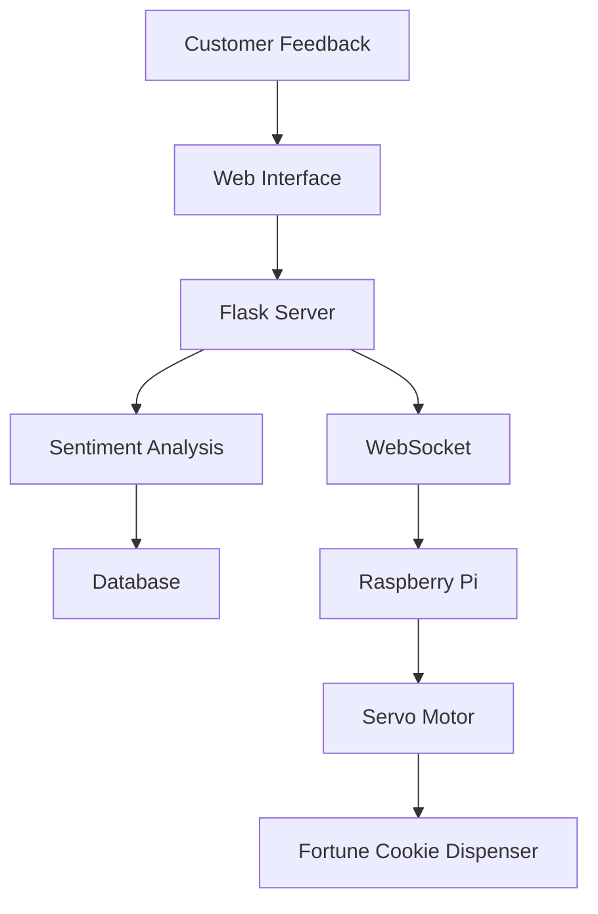
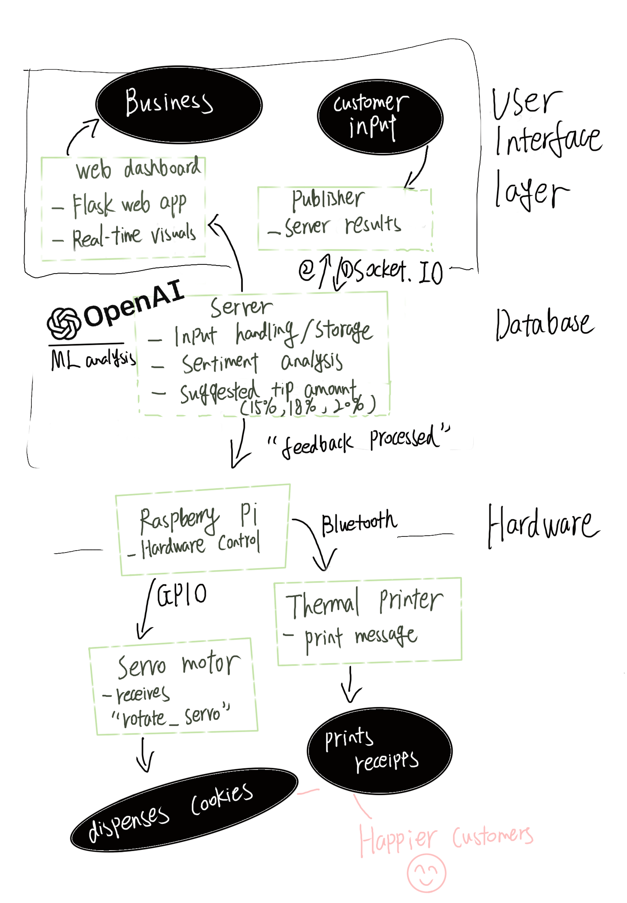
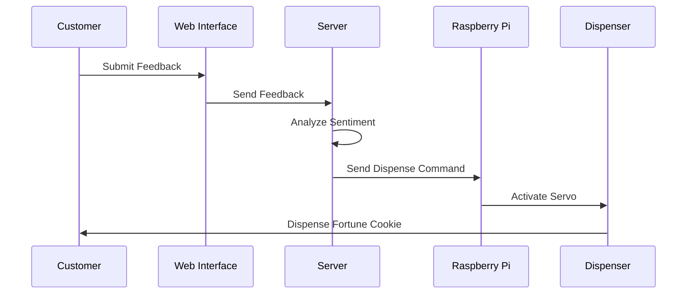
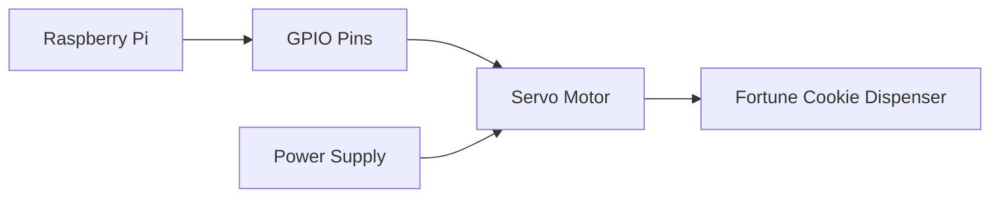

# Fortune Flow - Customer Feedback System

A real-time customer feedback system that analyzes sentiment and dispenses fortune cookies based on feedback, creating an engaging and interactive customer experience.

## System Architecture Diagram


*Figure: System architecture showing the flow from customer input, through the server and hardware, to the final customer experience. See fallback diagram below if image does not display.*



## User Flow Chart


*Figure: User flow from customer terminal input, through backend processing, to business dashboard visualization. See fallback diagram below if image does not display.*



## Circuit Diagram


*Figure: Circuit diagram showing the connections between Raspberry Pi, servo motor, and thermal printer. See fallback diagram below if image does not display.*

<details>
<summary>Fallback: Text-based Circuit Diagram (Mermaid)</summary>


</details>

## Product Description

Fortune Flow is an innovative customer feedback system that combines sentiment analysis with a physical reward mechanism. When customers provide feedback, the system analyzes their sentiment and dispenses a fortune cookie with a personalized message based on their experience.

### Target Audience
- Restaurant owners and managers
- Customer service departments
- Businesses seeking to enhance customer engagement
- Hospitality industry professionals

### Value Proposition
- Real-time customer sentiment analysis
- Engaging feedback collection mechanism
- Tangible rewards for customer participation
- Data-driven insights for business improvement

### Technology Stack
- **Backend**: Flask (Python)
- **Real-time Communication**: WebSocket
- **Database**: SQLite
- **Sentiment Analysis**: Open AI API
- **Hardware**: Raspberry Pi, Servo Motor
- **Visualization**: Plotly.js

## Materials and Costs

### Hardware Components

| Item                              | Purpose                                                        | Vendor     | Price (USD) |
|-----------------------------------|----------------------------------------------------------------|------------|-------------|
| Raspberry Pi 4 (2GB or 4GB)       | Main processing unit for running the server & interfacing with sensors | Adafruit   | $45.00      |
| Bluetooth Thermal Printer         | Print out customized messages and suggested tip amount for customers | Amazon     | $25.00      |
| SG90 Servo Motor                  | To dispense a fortune cookie based on sentiment                | SparkFun   | $3.95       |
| USB Power Supply for Pi           | To power Raspberry Pi securely                                 | Adafruit   | $7.50       |
| Fortune Cookies (bulk pack)       | Actual cookies for dispensing (colored or customized)          | Amazon     | $16.99      |

### Software Components
1. Development Time - $500
2. Cloud Services - $20/month
3. Maintenance - $100/month

### Total Cost per Unit: $130
### Target Retail Price: $299
### Margin per Unit: $169 (57%)

## Consumer Case Study

A local restaurant implemented Fortune Flow and saw a 40% increase in customer feedback submissions within the first month. The interactive nature of receiving a fortune cookie after providing feedback created a fun experience for customers, while the restaurant gained valuable insights into customer satisfaction trends. The system's real-time sentiment analysis helped the management team quickly identify and address service issues, leading to a 15% improvement in customer satisfaction scores. 

## Vertical and Market Fit

### Vertical
Hospitality and Customer Service Technology

### Compelling Factors
1. Unique combination of digital and physical interaction
2. Immediate customer engagement
3. Actionable insights through sentiment analysis
4. Cost-effective solution for feedback collection
5. Cultural identity and a way to increase popularity of such mid-sized to small businesses 

### Price Justification
- Competitive with other feedback systems
- ROI through increased customer engagement
- Low maintenance costs
- Scalable solution for multiple locations

## Technical Implementation

### Communication Protocol
- WebSocket for real-time communication
- REST API for data management
- Socket IO for hardware control

### Machine Learning Framework
- Open AI API for sentiment analysis
- Real-time processing pipeline

## Product Reflection

Fortune Flow was born from the need to make customer feedback collection more engaging and meaningful. Traditional feedback systems often suffer from low participation rates and delayed responses. By combining sentiment analysis with a physical reward mechanism, we've created a system that not only collects valuable customer insights but also enhances the overall customer experience. The personal connection to this project comes from witnessing the disconnect between businesses and their customers' true sentiments, and the desire to bridge this gap through innovative technology.

## Project Structure

```
Fortune-Flow/
├── server/                    # Server-side components (Mac)
│   ├── sub.py                # Main server application
│   ├── publisher.py          # Feedback publisher
│   ├── sentiment.py          # Sentiment analysis module
│   ├── models.py             # Database models
│   ├── requirements.txt      # Server dependencies
│   ├── templates/            # HTML templates
│   └── static/               # Static assets
│
└── raspberry/                # Raspberry Pi components
    ├── servo_controller.py   # Servo motor controller
    ├── printer_controller.py # Thermal printer controller
    └── requirements.txt      # Raspberry Pi dependencies
```

## Setup Instructions

### Server Setup (Mac)

1. Create and activate a virtual environment:
```bash
python -m venv venv
source venv/bin/activate
```

2. Install dependencies:
```bash
pip install -r requirements.txt
```

3. Start the server:
```bash
python sub.py
```

### Raspberry Pi Setup

1. Create and activate a virtual environment:
```bash
python -m venv venv
source venv/bin/activate
```

2. Install dependencies:
```bash
pip install -r requirements.txt
```

3. Start the servo controller:
```bash
python servo_controller.py
```
4. Start the printer controller:
```bash
python printer_controller.py
```
```

## Usage

1. Start the server on your Mac
2. Start the servo controller on your Raspberry Pi
3. Run the publisher script to submit feedback:
```bash
python publisher.py
```

## Dependencies

### Server Dependencies
- Flask
- Flask-SocketIO
- SQLAlchemy
- NLTK
- Plotly
- Flask-CORS

### Raspberry Pi Dependencies
- RPi.GPIO
- python-socketio
- eventlet

## License

MIT License 